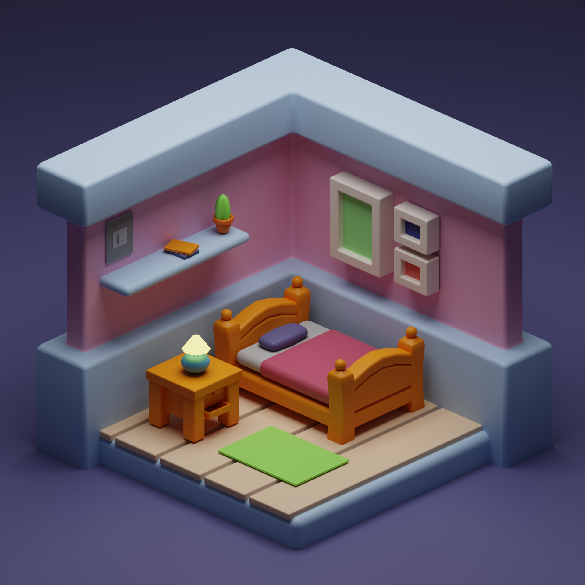
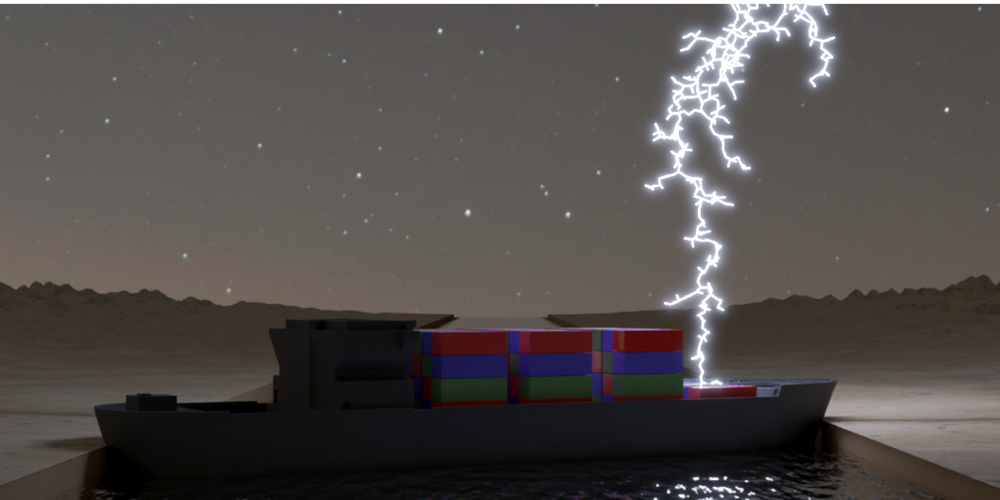
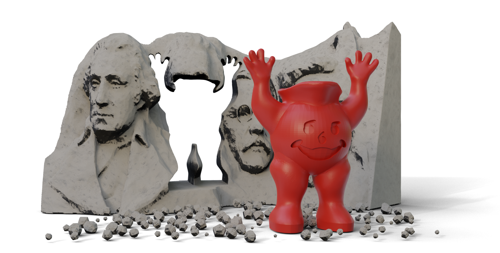

# Art?

Calling something I have made myself "art" feels pretentious but here is stuff I have done for fun that I am proud of (mostly so I don't lose track of it myself).

 
 

<i>An isometric room done following <a href="https://youtu.be/yCHT23A6aJA">this tutorial</a> by 3DGreenhorn</i>, 2022
 
 
 
 

<i>Himmelblau ft. Joan Miró</i>, 2021
 
 
 
 

<i>One in a million chance</i>, 2021
 
 
 
 

<i>A particularly nice logarithm of a meromorphic function (made with <a href="code/meromorphic.m">this Matlab script</a></i>), 2021
 
 
 
 

<i>The American Dream</i>, 2020
 
 
 
 

<i>Graphics in the '80s</i>, 2020
 
 

