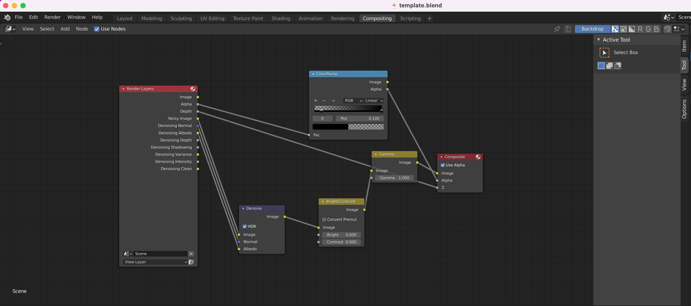
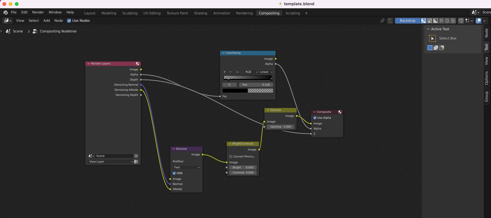
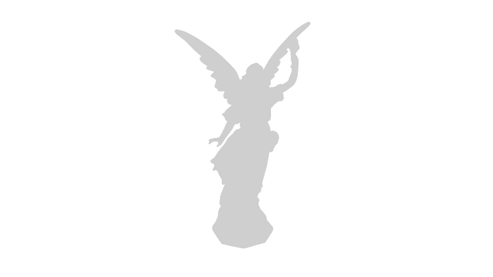
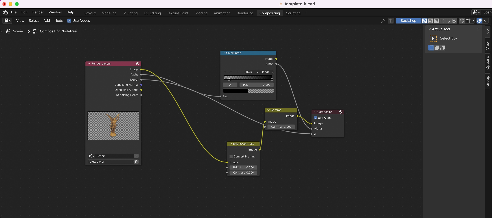
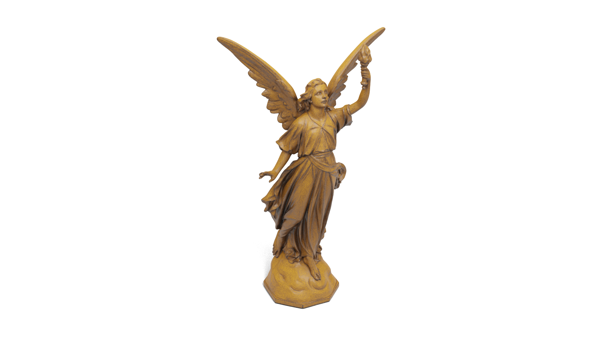

# PSA: Update your compositing nodes for 3.0

For the most part, you can open and render your Blender 2.9 files using the new
and improved [Blender 3.0](https://www.blender.org/download/). You may want to
do this because Blender 3.0's rendering is extremely improved from the previous
versions or because you started a project on 2.9/2.8 and now want to continue it
in 3.0. There is only one compatibility issue I have encountered, but it can
completely destroy your render.

Say your Blender 2.8/2.9 file used compositing nodes, like [my Blender 2.9
template paper figure file](images/blender-tutorial/template-old.blend). The
compositing view in Blender 2.9 may look like this:

As you can see, we are passing "Noisy Image" from our render to the "Denoiser"
node. However, if we open this same file in Blender 3.0, we see the following:

The "Noisy Image" output has disappeared! And therefore nothing is going into
our "Denoise" node. This is (I think) because Blender 3.0 no longer does
denoising as post-processing in the compositing step; instead, you can turn on
"Denoise" in the Render Output panel. If we choose to render the image, we will
get empty RGB channels, because no RGB channels are entering the denoiser:

Fixing this is simple: just circunvent the denoising node and connect the
"Image" output from the Render node with the "Image" input of the next node in
the chain; in my case, the "Bright/Contrast" one:

And we can render and composit to get the expected result:

