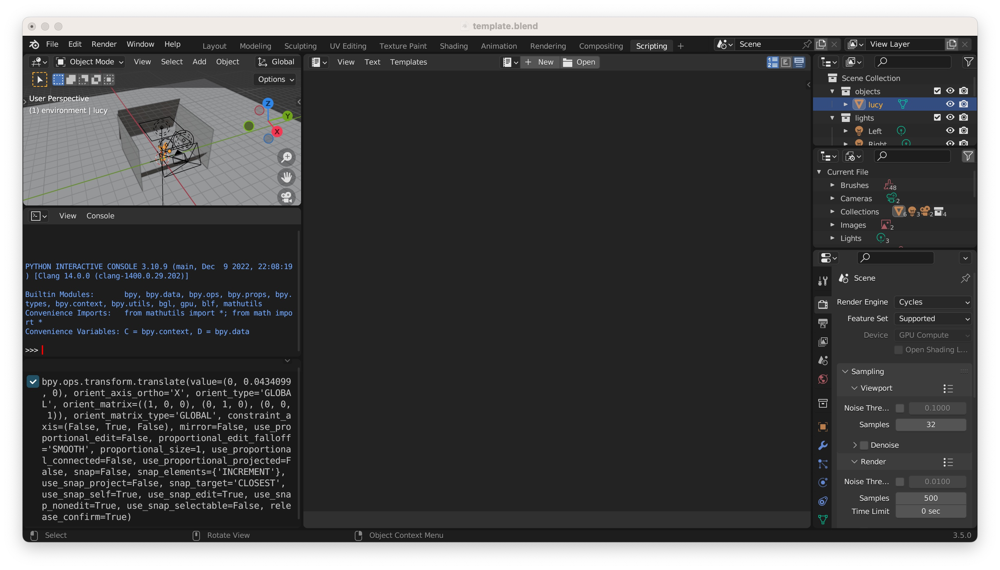
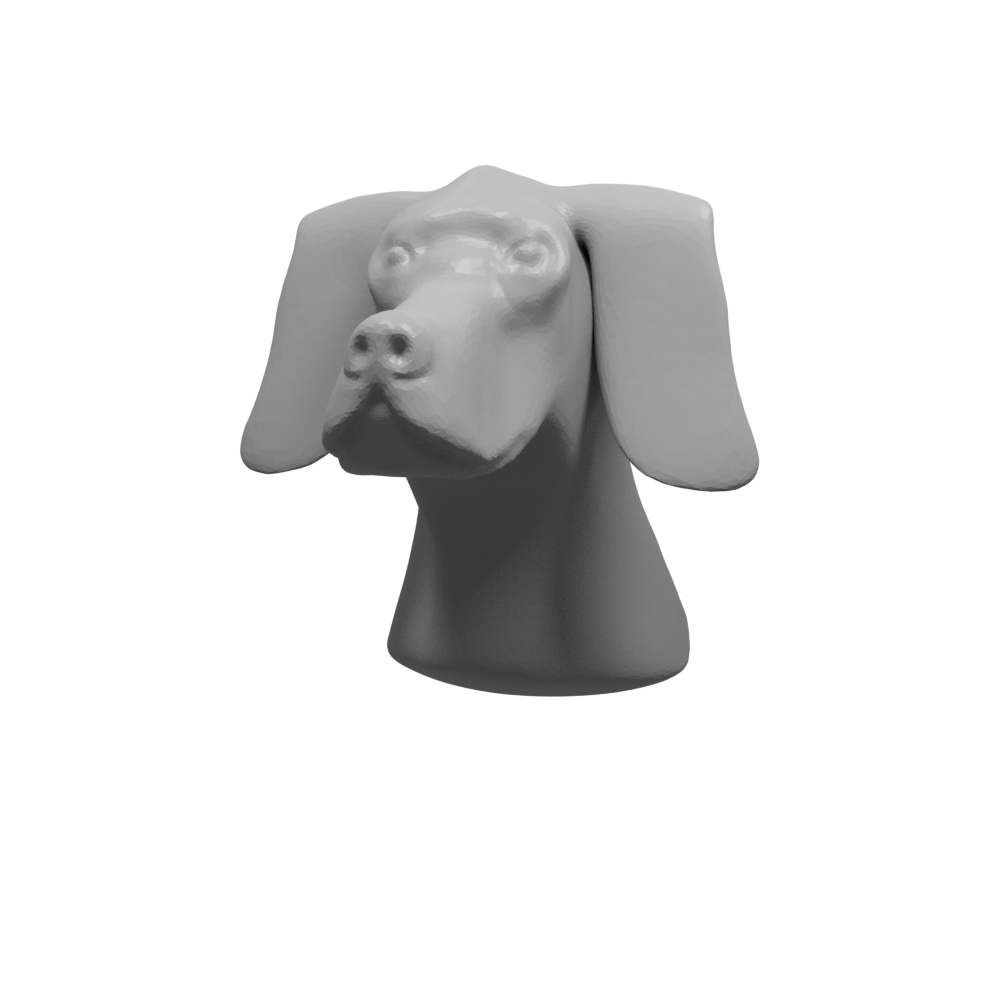

# GI 2023 Blender Course IV: Rendering static images and animations programatically using Blender scripts


#### Introduction: showing scripting screen in GUI

Let's open any Blender file, like [our template file](images/blender-tutorial/template.blend), and let's fine-tune it a little bit; for example, by changing the main object's position.


We can now navigate to the *scripting* window by clicking on the top right, next to *compositing*, to find something like this



If we look closely at the console of the left, we can see a history of all the recent commands that have been applied to this file through its user interface. In this case, we see one command that corresponds to moving the main object in the scene.

Of course, as computer scientists, it may not be surprising for us to see that all the actions we take in Blender's graphical interface correspond to executing specific programatic commands. However, what is special about Blender is that these commands are in an accessible, readable programming language (python) and they are exposed such that anyone can learn them and write their own Blender scripts. This option is most attractive to us as academics: often, we want to render two objects with the exact same rendering setup (e.g., for a comparison) or we may want to update a paper figures after a chage in our method by simply re-running a script, without having to resort to hours of GUI manipulation.

#### Blender toolbox, clone

The *best* way to start scripting on Blender is with the help of [Hsueh-Ti Derek Liu]()'s own [Blender toolbox](https://github.com/HTDerekLiu/BlenderToolbox). We can clone it by running

```bash
git clone https://github.com/HTDerekLiu/BlenderToolbox.git
```

Some of the aspects of this tutorial will rely on specific hardcoded paths, so let us from now on assume that our directory structure looks like this for some master directory `dir`:

```
dir/  
└── BlenderToolbox/  
```

#### First steps: imports and initialize scene, saving file

To start writing our first Blender script, we will create a new file called `render.py` and store it in `dir`:

```
dir/  
└── BlenderToolbox/  
└── render.py
```

Our file `render.py` will start with some basic library imports (*tip: watch out for the differences in capitalization of "toolbox"*).

```python
import sys, os, bpy, bmesh
import numpy as np
this_file_path = os.path.dirname(__file__)
sys.path.append(os.path.join(this_file_path,'BlenderToolbox'))
import BlenderToolBox as bt
```

We can now validate that our library import works by executing `render.py`. A common mistake here is to attempt to run it using your own local installation of python (e.g., by running `python render.py` or `python3 render.py`). Instead, we need to execute it through Blender's python installation, by running
```bash
/your/path/to/blender --background --python render.py
```
where it should be noted that the path is to the blender binary, not the application. For example, on my MacBook, the path is `/Applications/Blender.app/Contents/MacOS/Blender`. Since we will often use this command, it can be useful to define a shorthand alias; for example, in my `~/.bash_profile` I have added
```bash
alias blender='/Applications/Blender.app/Contents/MacOS/Blender'
function blender-python() {
    if [ "$1" == "-q" ] || [ "$1" == "--quiet" ] ; then
        blender --background --python "$2" 1> /dev/null
    else
        blender --background --python "$1"
    fi
}
```
which allows me to use `blender` to refer to the whole path above, and `blender-python` to add the `--background --python` options. Then, we can just do
```bash
blender-python render.py
```
Command line aliases can be a little tricky, so if this does not work for you, do not fret. Just swap `blender-python` for `/your/path/to/blender --background --python` in all that follows.

Alright! Hopefully our imports worked and `render.py` executed without issues. We can now start creating our Blender file programatically. Our first step will be to initialize a scene with a given resolution. We could do this by adding this after the imports:
```python
resolution_x = 100
resolution_y = 100
bt.blenderInit(resolution_x,resolution_y)
```

In practice, it can be useful to have a parameter `mult` that we can use to easily alternate between the low resolutions we tend to use for prototyping and the high ones for final figure versions:


```python
mult = 10
resolution_x = 100*mult
resolution_y = 100*mult
numSamples = 100*mult # no need to understand what this does yet
bt.blenderInit(resolution_x,resolution_y,numSamples=numSamples)
```

Our `render.py` should look like this now:
```python
import sys, os, bpy, bmesh
import numpy as np
this_file_path = os.path.dirname(__file__)
sys.path.append(os.path.join(this_file_path,'BlenderToolbox'))
import BlenderToolBox as bt

mult = 10
resolution_x = 100*mult
resolution_y = 100*mult
numSamples = 100*mult # no need to understand what this does yet
bt.blenderInit(resolution_x,resolution_y,numSamples=numSamples)
```

#### Save file

Hopefully, running `blender-python render.py` on the script above does not return any errors. This means it has succesfully initialized a blender scene; however, it can be hard to validate that it has done so correctly. A good way of doing this is by adding a last instruction at the end of `render.py` to save the scene into a `.blend` Blender file:
```python
save_path = this_file_path + '/test.blend'
bpy.ops.wm.save_mainfile(filepath=save_path)
```

Our `render.py` should look like this now:

```python
# boring imports
import sys, os, bpy, bmesh
import numpy as np
this_file_path = os.path.dirname(__file__)
sys.path.append(os.path.join(this_file_path,'BlenderToolbox'))
import BlenderToolBox as bt

# initialize shape
mult = 1 # make this 1-5 for fast, 10-15 for final paper
resolution_x = 100*mult
resolution_y = 100*mult
numSamples = 100*mult # no need to understand what this does yet
bt.blenderInit(resolution_x,resolution_y,numSamples=numSamples)

# save to blend file
save_path = this_file_path + '/test.blend'
bpy.ops.wm.save_mainfile(filepath=save_path)
```

Our directory will now be populated with a `test.blend` file:
```
dir/  
└── BlenderToolbox/  
└── render.py  
└── test.blend
```

If we open it, we will indeed see an empty scene; and if we go to the render paramaters, we will see the expected 100 by 100 resolution:


#### Read mesh

Let's now import the object we want to render. We can do this with `bt.readMesh`. For example, let us assume that we have a mesh called `dog.obj` ([here](images/blender-tutorial/dog.obj)'s a good one!) in our directory
```
dir/  
└── BlenderToolbox/  
└── render.py  
└── test.blend  
└── dog.obj
```
In that case, we can read it with
```python
path_to_mesh = this_file_path + '/dog.obj'
mesh_location = (0,0,0)
mesh_rotation = (0,0,0)
mesh_scale = (1,1,1)
mesh = bt.readMesh(path_to_mesh,mesh_location,mesh_rotation,mesh_scale)
```

It can be hard to come up with the correct location and translation without any visual cues. Instead of trying to do that, I recommend starting by making them zero, as above. Then, if we make sure to place the call to `readMesh` *before* the call to `save_mainfile`, we can run `blender-python render.py` and open the resulting `test.blend`:


Then, we can use the GUI to find a good orientation, which in this case is `(90,0,0)`


and update that rotation in our script, such that `render.py` now looks like this:
```python
# boring imports
import sys, os, bpy, bmesh
import numpy as np
this_file_path = os.path.dirname(__file__)
sys.path.append(os.path.join(this_file_path,'BlenderToolbox'))
import BlenderToolBox as bt

# initialize shape
mult = 1 # make this 1-5 for fast, 10-15 for final paper
resolution_x = 100*mult
resolution_y = 100*mult
numSamples = 100*mult # no need to understand what this does yet
bt.blenderInit(resolution_x,resolution_y,numSamples=numSamples)

# read mesh
path_to_mesh = this_file_path + '/dog.obj'
mesh_location = (0,0,0)
mesh_rotation = (90,0,0)
mesh_scale = (1,1,1)
mesh = bt.readMesh(path_to_mesh,mesh_location,mesh_rotation,mesh_scale)

# save to blend file
save_path = this_file_path + '/test.blend'
bpy.ops.wm.save_mainfile(filepath=save_path)
```

### Camera

Once we have imported the object, the next critical element we need to take an image of it is a camera. In a similar way to how we set up the mesh, we will import the camera with zero rotation and translation

```python
# add camera
cam_location = (0,0,0)
cam_rotation = (0,0,0)
cam = bt.setCamera_from_UI(cam_location,cam_rotation)
```
then open the generated `test.blend`:


We can now move the camera until the optimal position is found


and update our `render.py` accordingly:
```python
# boring imports
import sys, os, bpy, bmesh
import numpy as np
this_file_path = os.path.dirname(__file__)
sys.path.append(os.path.join(this_file_path,'BlenderToolbox'))
import BlenderToolBox as bt

# initialize shape
mult = 1 # make this 1-5 for fast, 10-15 for final paper
resolution_x = 100*mult
resolution_y = 100*mult
numSamples = 100*mult # no need to understand what this does yet
bt.blenderInit(resolution_x,resolution_y,numSamples=numSamples)

# read mesh
path_to_mesh = this_file_path + '/dog.obj'
mesh_location = (0,0,0)
mesh_rotation = (90,0,0)
mesh_scale = (1,1,1)
mesh = bt.readMesh(path_to_mesh,mesh_location,mesh_rotation,mesh_scale)

# add camera
cam_location = (2.5,-5,1)
cam_rotation = (75,0,25)
cam = bt.setCamera_from_UI(cam_location,cam_rotation)

# save to blend file
save_path = this_file_path + '/test.blend'
bpy.ops.wm.save_mainfile(filepath=save_path)
```

#### Render with command line

Alright! We have an object and a camera: that's the minimal set we need to render a picture. We can do it with one last line of code:
```python
image_path = this_file_path + '/image.png'
bt.renderImage(image_path, cam)
```
such that our full `render.py` looks like this:
```python
# boring imports
import sys, os, bpy, bmesh
import numpy as np
this_file_path = os.path.dirname(__file__)
sys.path.append(os.path.join(this_file_path,'BlenderToolbox'))
import BlenderToolBox as bt

# initialize shape
mult = 5 # make this 1-5 for fast, 10-15 for final paper
resolution_x = 100*mult
resolution_y = 100*mult
numSamples = 100*mult # no need to understand what this does yet
bt.blenderInit(resolution_x,resolution_y,numSamples=numSamples)

# read mesh
path_to_mesh = this_file_path + '/dog.obj'
mesh_location = (0,0,0)
mesh_rotation = (90,0,0)
mesh_scale = (1,1,1)
mesh = bt.readMesh(path_to_mesh,mesh_location,mesh_rotation,mesh_scale)

# add camera
cam_location = (2.5,-5,1)
cam_rotation = (75,0,25)
cam = bt.setCamera_from_UI(cam_location,cam_rotation)

# render
image_path = this_file_path + '/image.png'
bt.renderImage(image_path, cam)

# save to blend file
save_path = this_file_path + '/test.blend'
bpy.ops.wm.save_mainfile(filepath=save_path)
```


If we now run `blender-python render.py`, we will get a new image in our directory
```
dir/  
└── BlenderToolbox/  
└── render.py  
└── test.blend  
└── dog.obj  
└── image.png
```
which, for now, looks like this (generated with `mult=5`):


It is very dark! And the reason is obvious: we have not added any lights yet. Let's do just that.

#### Lights: ambient, sun, three point

The Blender Toolbox gives us many different lighting options. For example, the simplest light one can add is a sun:
```python
light = bt.setLight_sun((45,45,45),1.0) # 45 is the angle, 1.0 is the brightness
```
A sunlight generally results in very sharp shadows:


Sharp shadows can be very aesthetically pleasing; however, they are generally not recommended for our research purposes, since they the shaded areas are so dark that they obscure the shape's geometric detail. A way of getting around this is to add a soft *ambient* light, which adds brightness to every part of the scene to avoid extremely dark areas:

```python
light = bt.setLight_sun((45,45,45),1.0)
bt.setLight_ambient(color=(0.2,0.2,0.2,1.0)) # 0.2 is the "strength" (from 0:black to 1:white)
```

This is the rendered output we get:


As expected, an ambient light avoids the extremely dark areas of the object, but it does so at the cost of over-lighting the areas that were exposed to the sun light, washing over some of the geometric detail.

A better choice for a lighting setup is the classic photographic technique called [three point lighting](https://en.wikipedia.org/wiki/Three-point_lighting), which we can also fortunately use with the Blender Toolbox:

```python
bt.setLight_threePoints(radius=10,height=10) # parameters are intuitive, but it's worth fine-tuning
```

If we now open the generated `blend` file, we see something like this, with the three point lights of differing intensities:


In a *proper* three-point lighting setup, the camera is near the strongest light, slightly angled towards the second strongest light. This orientation is a key part of why this lighting setup works, so we will need to change the position of the camera and object accordingly:


Our `render.py` thus looks like this:
```python
# boring imports
import sys, os, bpy, bmesh
import numpy as np
this_file_path = os.path.dirname(__file__)
sys.path.append(os.path.join(this_file_path,'BlenderToolbox'))
import BlenderToolBox as bt

# initialize shape
mult = 5 # make this 1-5 for fast, 10-15 for final paper
resolution_x = 100*mult
resolution_y = 100*mult
numSamples = 100*mult # no need to understand what this does yet
bt.blenderInit(resolution_x,resolution_y,numSamples=numSamples)

# read mesh
path_to_mesh = this_file_path + '/dog.obj'
mesh_location = (0,0,0)
mesh_rotation = (90,0,110)
mesh_scale = (1,1,1)
mesh = bt.readMesh(path_to_mesh,mesh_location,mesh_rotation,mesh_scale)

# add camera
cam_location = (5.5,4,0.25)
cam_rotation = (80,0,125)
cam = bt.setCamera_from_UI(cam_location,cam_rotation)

# add light
# light = bt.setLight_sun((45,45,45),1.0)
bt.setLight_threePoints(radius=10,height=10)
bt.setLight_ambient(color=(0.05,0.05,0.05,1.0)) # 0.05 is the "strength" (from 0:black to 1:white)

# render
image_path = this_file_path + '/image.png'
bt.renderImage(image_path, cam)

# save to blend file
save_path = this_file_path + '/test.blend'
bpy.ops.wm.save_mainfile(filepath=save_path)
```

and produces a much more satisfying shape:


#### Material: color, singlecolor material, plastic, transparent, metal, glass, honey

Okay! We're getting somewhere. The only essential step left is to give our shape a nice material, so that it does not look like it is made out of grey chalk. The Blender Toolbox *shines* at making it easy to add amazing-looking materials. The specifics will depend on each material but, broadly speaking, applying a material works in two steps: first, defining the color (e.g, "blue") and, second, assinging the mesh a material with said color (e.g., "blue plastic").

The first part is common to most materials:
```python
mesh_rgba = (178.0/255.0,223.0/255.0,138.0/255.0,1.0) # rgba
mesh_color = bt.colorObj(mesh_rgba) # "blender" color
```

The second part, for a plastic material, looks like this (make sure to have this code execute after `mesh` has been imported):
```python
bt.setMat_plastic(mesh,mesh_color)
```

If we add these lines to `render.py`, which would then look like this:
```python
# boring imports
import sys, os, bpy, bmesh
import numpy as np
this_file_path = os.path.dirname(__file__)
sys.path.append(os.path.join(this_file_path,'BlenderToolbox'))
import BlenderToolBox as bt

# initialize shape
mult = 10 # make this 1-5 for fast, 10-15 for final paper
resolution_x = 100*mult
resolution_y = 100*mult
numSamples = 100*mult # no need to understand what this does yet
bt.blenderInit(resolution_x,resolution_y,numSamples=numSamples)

# read mesh
path_to_mesh = this_file_path + '/dog.obj'
mesh_location = (0,0,0)
mesh_rotation = (90,0,110)
mesh_scale = (1,1,1)
mesh = bt.readMesh(path_to_mesh,mesh_location,mesh_rotation,mesh_scale)

# material
mesh_rgba = (178.0/255.0,223.0/255.0,138.0/255.0,1.0) # rgba
mesh_color = bt.colorObj(mesh_rgba) # "blender" color
bt.setMat_plastic(mesh,mesh_color)

# add camera
cam_location = (5.5,4,0.25)
cam_rotation = (80,0,125)
cam = bt.setCamera_from_UI(cam_location,cam_rotation)

# add light
# light = bt.setLight_sun((45,45,45),1.0)
bt.setLight_threePoints(radius=10,height=10)
bt.setLight_ambient(color=(0.05,0.05,0.05,1.0)) # 0.05 is the "strength" (from 0:black to 1:white)

# render
image_path = this_file_path + '/image.png'
bt.renderImage(image_path, cam)

# save to blend file
save_path = this_file_path + '/test.blend'
bpy.ops.wm.save_mainfile(filepath=save_path)
```
we produce this rendered image (now using `mult=10` to appreciate more nuanced distinctions):


There are many other materials supported by BlenderToolbox. My favourite one is `singleColor`, which one can obtain with
```python
AO = 1.0 # ambient occlusion
bt.setMat_singleColor(mesh,mesh_color,AO)
```
and looks like this:


I know. Beautiful. Gracious.

Unfortunately, there seems to be some compatibility issue with this function and the newest version of Blender; therefore, you may encounter an error if attempting to run the above (I generally recommend using Blender 3.0 precisely because of this).

There are other useful materials; for example, one I use a lot is the `transparent` one:
```python
bt.setMat_transparent(mesh, mesh_color, 0.5, 0.2)
```


`metal` is also very cool:
```python
AO = 1.0 # ambient occlusion
bt.setMat_metal(mesh, mesh_color, AO, 0.9)
```


and `glass`:
```python
bt.setMat_glass(mesh, mesh_color,0.1)
```


#### Vertex values

Often, we don't just want to render a shape with a single color, but we want to use colors to convey some scalar information defined on each vertex or face of the object. This is a very common situation, which one can also render using the Blender Toolbox.

Let's open a new file, `scalar_data.py`,
```
dir/  
└── BlenderToolbox/  
└── render.py  
└── scalar_data.py  
└── test.blend  
└── dog.obj  
└── image.png
```
and use it to write some simple per-vertex data on our mesh and save it to a numpy file (you may need to `pip install gpytoolbox`):
```python
import gpytoolbox
import numpy as np

v, f = gpytoolbox.read_mesh('dog.obj')
vertex_data = v[:,0]
np.save('vertex_data.npy',vertex_data)
```

Now, if we run `python scalard_data.py` (with your own python! not Blender's!), a new `vertex_data.npy` file should be generated:
```
dir/  
└── BlenderToolbox/  
└── render.py  
└── scalar_data.py  
└── vertex_data.npy  
└── test.blend  
└── dog.obj  
└── image.png  
```
In `render.py`, we can read this file to build a material with per-vertex colors. The setup is slightly convoluted, but since we only really need it for this specific use-case there isn't much need to understand it at depth:
```python
vertex_data = np.load('vertex_data.npy')
mesh = bt.setMeshScalars(mesh,vertex_data)
mesh_color_with_data = bt.colorObj([],0.5,1.0,1.0,0.0,0.0)
bt.setMat_VColor(mesh,mesh_color_with_data)
```

Our `render.py` would therefore look like
```python
# boring imports
import sys, os, bpy, bmesh
import numpy as np
this_file_path = os.path.dirname(__file__)
sys.path.append(os.path.join(this_file_path,'BlenderToolbox'))
import BlenderToolBox as bt

# initialize shape
mult = 10 # make this 1-5 for fast, 10-15 for final paper
resolution_x = 100*mult
resolution_y = 100*mult
numSamples = 100*mult # no need to understand what this does yet
bt.blenderInit(resolution_x,resolution_y,numSamples=numSamples)

# read mesh
path_to_mesh = this_file_path + '/dog.obj'
mesh_location = (0,0,0)
mesh_rotation = (90,0,110)
mesh_scale = (1,1,1)
mesh = bt.readMesh(path_to_mesh,mesh_location,mesh_rotation,mesh_scale)

# material
# commented all the materials we tried
# # mesh_rgba = (178.0/255.0,223.0/255.0,138.0/255.0,1.0) # rgba
# # mesh_color = bt.colorObj(mesh_rgba) # "blender" color
# # bt.setMat_plastic(mesh,mesh_color)
# # AO = 1.0
# # bt.setMat_singleColor(mesh,mesh_color,AO)
# # bt.setMat_transparent(mesh, mesh_color, 0.5, 0.2)
# # AO = 1.0 # ambient occlusion
# # bt.setMat_metal(mesh, mesh_color, AO, 0.9)
# # bt.setMat_glass(mesh, mesh_color,0.1)
# per-vertex colors
vertex_data = np.load('vertex_data.npy')
mesh = bt.setMeshScalars(mesh,vertex_data)
mesh_color_with_data = bt.colorObj([],0.5,1.0,1.0,0.0,0.0)
bt.setMat_VColor(mesh,mesh_color_with_data)

# add camera
cam_location = (5.5,4,0.25)
cam_rotation = (80,0,125)
cam = bt.setCamera_from_UI(cam_location,cam_rotation)

# add light
# light = bt.setLight_sun((45,45,45),1.0)
bt.setLight_threePoints(radius=10,height=10)
bt.setLight_ambient(color=(0.05,0.05,0.05,1.0)) # 0.05 is the "strength" (from 0:black to 1:white)

# render
image_path = this_file_path + '/image.png'
bt.renderImage(image_path, cam)

# save to blend file
save_path = this_file_path + '/test.blend'
bpy.ops.wm.save_mainfile(filepath=save_path)
```
and produce this:


<!-- #### Final render -->
#### Rendering-specific python module

We iterated a lot and tried many different things to converge on a good rendering style that we like. Using scripts instead of the blender GUI means that we can now amortize all that work and save our choices in a way that's consistent across all our paper figures. To do this, I like to use a directory structure like this:

```
dir/  
└── BlenderToolbox/  
└── render_utility/  
└─────── __init__.py  
└─────── misc.py  
└── render.py  
└── scalar_data.py  
└── vertex_data.npy  
└── test.blend  
└── dog.obj  
└── image.png  
```

Here's what `render_utility/__init__.py` looks like (this is just a file that tells `python` that this is a module):
```python
from .misc import *
```
and, on the other hand, here's what `misc.py` can look like, containing all our general rendering functionality:
```python
# basic imports
import sys, os
# blender toolbox
sys.path.append(os.path.join(os.path.dirname(__file__), '..', 'BlenderToolbox'))
import BlenderToolBox as bt
# base blender python functionality
import bpy
import numpy as np

# cbrewer
hardred = (228.0/255, 26.0/255, 28.0/255, 1.0)
hardblue = (55.0/255, 126.0/255, 184.0/255, 1.0) # blue
hardgreen = (77.0/255, 175.0/255, 74.0/255, 1.0) # green
hardpurple = (152.0/255, 78.0/255, 163.0/255, 1.0) # purple
hardorange = (255.0/255, 127.0/255, 0.0/255, 1.0) # orange
hardyellow = (255.0/255, 255.0/255, 51.0/255, 1.0) # yellow
hardbrown = (166.0/255, 86.0/255, 40.0/255, 1.0) # brown
hardpink = (247.0/255, 129.0/255, 191.0/255, 1.0) # pink
grey = (128.0/255, 128.0/255, 128.0/255, 1.0) # grey
softblue = (191.0/255, 211.0/255, 230.0/255, 1.0) # light blue

ourcolor = hardgreen

def setup_scene(mult,cam_position,cam_rotation):
    resolution = 100*mult
    bt.blenderInit(resolution,resolution,numSamples=100*mult)
    cam = bt.setCamera_from_UI(cam_position,cam_rotation)
    bt.setLight_threePoints()
    bt.setLight_ambient(color=(0.05,0.05,0.05,1.0))
    return cam

def plot_our_mesh(path,rgba = ourcolor, location = (0,0,0), rotation = (90,0,110)):
    mesh = bt.readMesh(path,location,rotation,(1,1,1))
    mesh_color = bt.colorObj(rgba) # "blender" color
    bt.setMat_plastic(mesh,mesh_color)
    return mesh

def render_scene(image_path,cam):
    bt.renderImage(image_path, cam)
```

Then, our `render.py` can just be:
```python
import os, sys
sys.path.append(os.path.dirname(__file__))
import render_utility

this_file_path = os.path.dirname(__file__)
path_to_mesh = this_file_path + '/dog.obj'
save_path = this_file_path + '/test.blend'
image_path = this_file_path + '/image.png'

cam = render_utility.setup_scene(10,(10,5,4),(70,0,110))
mesh = render_utility.plot_our_mesh(path_to_mesh)
render_utility.render_scene(image_path,cam)
```

### Leveraging render-specific module to make a new figure

If, for example, I want to make a new script comparing three objs in `comparison/`,
```
dir/  
└── BlenderToolbox/  
└── render_utility/  
└─────── __init__.py  
└─────── misc.py  
└── comparison/  
└─────── ours.obj  
└─────── input.obj  
└─────── theirs.obj  
└── render.py  
└── scalar_data.py  
└── vertex_data.npy  
└── test.blend  
└── dog.obj  
└── image.png  
```
all I need to add is a new render file called `render_comparison.py`:
```python
import os, sys
sys.path.append(os.path.dirname(__file__))
import render_utility

this_file_path = os.path.dirname(__file__)
path_to_our_mesh = this_file_path + '/comparison/ours.obj'
path_to_their_mesh = this_file_path + '/comparison/theirs.obj'
path_to_input_mesh = this_file_path + '/comparison/input.obj'
our_image_path = this_file_path + '/ours_image.png'
input_image_path = this_file_path + '/input_image.png'
their_image_path = this_file_path + '/their_image.png'

def plot_input_mesh(path):
    return render_utility.plot_our_mesh(path,rgba=(0.5,0.5,0.5,1.0))

def plot_their_mesh(path):
    return render_utility.plot_our_mesh(path,rgba=(0.2,0.2,0.5,1.0))

cam_location = (5.5,4,0.25)
cam_rotation = (80,0,125)

# ours
cam = render_utility.setup_scene(2,cam_location,cam_rotation)
mesh = render_utility.plot_our_mesh(path_to_our_mesh)
render_utility.render_scene(our_image_path,cam)

# input
cam = render_utility.setup_scene(2,cam_location,cam_rotation)
mesh = plot_input_mesh(path_to_input_mesh)
render_utility.render_scene(input_image_path,cam)

# theirs
cam = render_utility.setup_scene(2,cam_location,cam_rotation)
mesh = plot_their_mesh(path_to_their_mesh)
render_utility.render_scene(their_image_path,cam)
```

Et voilà!




#### *Exercise: slices*
