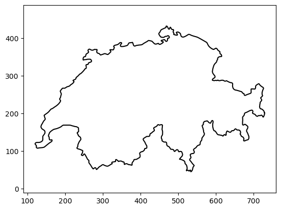

# Quick 2D prototyping with Gpytoolbox II: Sampling 2D polylines


[*Gpytoolbox* version 0.1.0](https://gpytoolbox.org/0.1.0/) has just been released!! You can install it directly through `pip`:

```bash
pip install gpytoolbox
```

This is the second in a series of blogposts highlighting features of our newly released library. You can find rest of the blog entries [here](https://www.silviasellan.com/posts.html). Today, we are looking at how to compute distances to 2D polylines.

In the last tutorial, we saw how to load simple two-dimensional polylines into Python using gpytoolbox to quickly test our research code on. The reason for using polylines as a shape representation is that they are the 2D equivalent to the very common 3D representation of triangle meshes. However, meshes are not the only way we represent geometry. In the next tutorials, we will see how to convert our 2D polylines into other representations.

One very common shape representation is *point clouds*, or unordered sets of points in space. This is the format in which most real-world geometry is captured; for example, by the scanner on an autonomous car. If we are testing a research idea that will work on point clouds, we may want a good way of generating 2D point clouds. We can do this by sampling random points on a polyline using Gpytoolbox's `random_points_on_mesh`:


```python
# Let's begin by loading the image into a polyline
from gpytoolbox import png2poly, edge_indices
poly = png2poly("switzerland.png")
vertices = poly[0]
edges = edge_indices(vertices.shape[0], closed=True)
_ = plt.plot(vertices[:, 0], vertices[:, 1], '-k')
_ = plt.axis('equal')
```


    

    


```python
# Now, call random_points_on_mesh to generate a point cloud
from gpytoolbox import random_points_on_mesh
point_cloud = random_points_on_mesh(vertices, edges, 100)
_ = plt.plot(point_cloud[:, 0], point_cloud[:, 1], 'o')
```


    

    


Et voilà! A beautifully neutral point cloud. For some applications, we may not be content with a point cloud; instead, we may want to generate an *oriented* point cloud where each point is also endowed with a direction perpendicular to the surface at that point. This is also an easy representation to get using gpytoolbox: since all the points fall on some flat edge, we need only know *which* edge and rotate it by ninety degrees. This is what the `return_indices` parameter in `random_points_on_mesh` is for: 


```python
point_cloud, I, _ = random_points_on_mesh(vertices, edges, 100, return_indices=True)
# What are the edges that the points are on?
edge_vectors = vertices[edges[I,0],:] - vertices[edges[I,1],:]
# Rotate the edge vectors by 90 degrees
edge_vectors = np.array([[-edge_vectors[:,1], edge_vectors[:,0]]]).squeeze().T
# Normalize the edge vectors so they have unit norm
normal_vectors = edge_vectors / np.linalg.norm(edge_vectors, axis=1)[:,None]
# Plot the point cloud and normals
_ = plt.plot(point_cloud[:, 0], point_cloud[:, 1], 'o')
_ = plt.quiver(point_cloud[:, 0], point_cloud[:, 1], normal_vectors[:,0], normal_vectors[:,1],)
```


    

    
