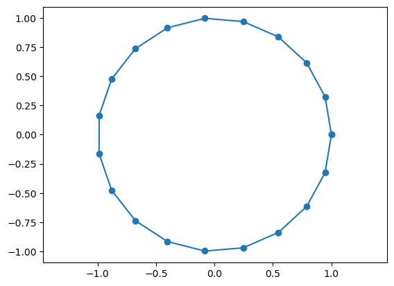
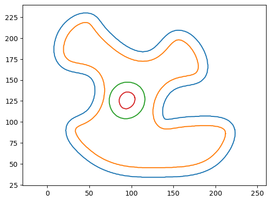
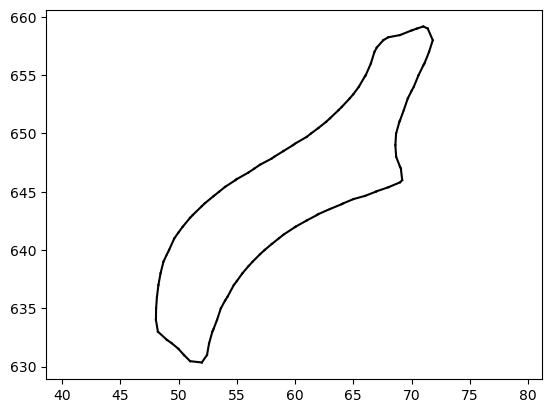
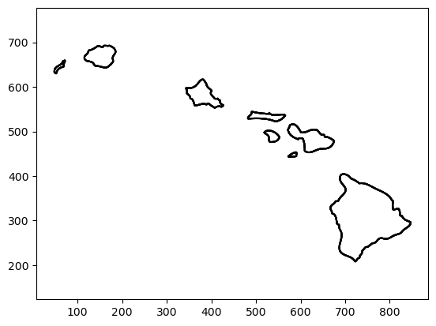

# Quick 2D prototyping with Gpytoolbox I: Generating 2D polylines 


[*Gpytoolbox* version 0.1.0](https://gpytoolbox.org/0.1.0/) has just been released!! You can install it directly through `pip`:

```bash
pip install gpytoolbox
```

*Gpytoolbox* shines when it comes to letting you test out your research ideas on simple 2D geometry before you commit to more complex three-dimensional examples and elaborately optimized implementations. Often, our final algorithm will use triangle meshes to represent surfaces in 3D. This means that, when prototyping in 2D, we will work with its equivalent: curves built by connecting flat segments (*edges*), which are usually called **polylines**. 
 
In code, polylines are often represented by a matrix of sorted *vertex* coordinates $V\in\mathbb{R}^{n\times 2}$. Each row contains the coordinates of a single vertex $v_i$, and the $i$-th edge is obtained by connecting the $i$-th vertex to the $i+1$-th vertex.

To make a simple polyline of a circle, `gpytoolbox` provides a simple wrapper:


```python
import numpy as np
from gpytoolbox import regular_circle_polyline
vertices, _ = regular_circle_polyline(20) # 20 vertices
```


```python
# We can plot our polyline using matplotlib
import matplotlib.pyplot as plt
_ = plt.plot(vertices[:, 0], vertices[:, 1], 'o-')
_ = plt.axis('equal')
```


    

    


...but circles are a very special class of shapes, which are very simple and have a high degree of symmetry. Also, they are very boring to look at. We can get more interesting geometry by using my favourite Gpytoolbox function, [`png2poly`](https://gpytoolbox.org/0.1.0/png2poly/), which reads polylines from `.png` files you can draw yourself or download from the internet. For example, I drew [this picture](https://github.com/sgsellan/gpytoolbox/blob/main/test/unit_tests_data/illustrator.png) on Adobe Illustrator. I can easily load it into Python using `png2poly`.


```python
from gpytoolbox import png2poly
poly = png2poly("illustrator.png")
```

`poly` now contains a list with every connected polyline in the png file. In our case, this list has four entries:


```python
print(len(poly))
```

    4


This may seem counterintuitive, but it makes sense if you think about it for a bit. Since the lines in our png file are so thick, `png2poly` is duplicating them: it finds one line for the transition from white to red and another one for the one from red to white; then again for white to blue and blue to white. We can visualize all of them:


```python
plt.plot(poly[0][:, 0], poly[0][:, 1], '-')
plt.plot(poly[1][:, 0], poly[1][:, 1], '-')
plt.plot(poly[2][:, 0], poly[2][:, 1], '-')
plt.plot(poly[3][:, 0], poly[3][:, 1], '-')
_ = plt.axis('equal')
```


    

    


Often, we are interested in only one of these components, so let's just make our vertex matrix be the first entry in the list:


```python
vertices = poly[0]
_ = plt.plot(vertices[:, 0], vertices[:, 1], '-')
_ = plt.axis('equal')
```


    

    


A really rich source of interesting 2D geometry that I really like to use is maps. For example, in many of my papers you'll find this Vietnam polyline that comes from [this](https://github.com/sgsellan/gpytoolbox/blob/main/test/unit_tests_data/vietnam.png) png file:


```python
poly = png2poly("vietnam.png")
plt.plot(poly[0][:, 0], poly[0][:, 1], '-b')
plt.plot(poly[1][:, 0], poly[1][:, 1], '-b')
_ = plt.axis('equal')
```


    

    


You might be wondering: what happens if I want a shape with more than one connected component? For example, consider this map of Hawaii:


```python
poly = png2poly("hawaii.png")
print("There are ", str(len(poly)), " connected polylines in the image.")
# We can plot them in a loop
for i in range(len(poly)):
    plt.plot(poly[i][:, 0], poly[i][:, 1], '-')
_ = plt.axis('equal')
```

    There are  8  connected polylines in the image.


    

    


To combine all the islands into a single polyline, we can can concatenate all the vertices and use an edge list `EC` that stores which vertices are connected. For a single connected component, this edge list is simple: the first vertex connects to the second vertex, the second vertex connects to the third, etc. 


```python
# Consider the first island
first_island_vertices = poly[0]
# Edge indices
from gpytoolbox import edge_indices
first_island_edges = edge_indices(first_island_vertices.shape[0], closed=True) # The 'closed' argument tells the function to connect the last vertex to the first one
print(first_island_edges)
```

    [[  0   1]
     [  1   2]
     [  2   3]
     [  3   4]
     [  4   5]
     [  5   6]
     [  6   7]
     [  7   8]
     [  8   9]
     [  9  10]
     [ 10  11]
     [ 11  12]
     [ 12  13]
     [ 13  14]
     [ 14  15]
     [ 15  16]
     [ 16  17]
     [ 17  18]
     [ 18  19]
     [ 19  20]
     [ 20  21]
     [ 21  22]
     [ 22  23]
     [ 23  24]
     [ 24  25]
     [ 25  26]
     [ 26  27]
     [ 27  28]
     [ 28  29]
     [ 29  30]
     [ 30  31]
     [ 31  32]
     [ 32  33]
     [ 33  34]
     [ 34  35]
     [ 35  36]
     [ 36  37]
     [ 37  38]
     [ 38  39]
     [ 39  40]
     [ 40  41]
     [ 41  42]
     [ 42  43]
     [ 43  44]
     [ 44  45]
     [ 45  46]
     [ 46  47]
     [ 47  48]
     [ 48  49]
     [ 49  50]
     [ 50  51]
     [ 51  52]
     [ 52  53]
     [ 53  54]
     [ 54  55]
     [ 55  56]
     [ 56  57]
     [ 57  58]
     [ 58  59]
     [ 59  60]
     [ 60  61]
     [ 61  62]
     [ 62  63]
     [ 63  64]
     [ 64  65]
     [ 65  66]
     [ 66  67]
     [ 67  68]
     [ 68  69]
     [ 69  70]
     [ 70  71]
     [ 71  72]
     [ 72  73]
     [ 73  74]
     [ 74  75]
     [ 75  76]
     [ 76  77]
     [ 77  78]
     [ 78  79]
     [ 79  80]
     [ 80  81]
     [ 81  82]
     [ 82  83]
     [ 83  84]
     [ 84  85]
     [ 85  86]
     [ 86  87]
     [ 87  88]
     [ 88  89]
     [ 89  90]
     [ 90  91]
     [ 91  92]
     [ 92  93]
     [ 93  94]
     [ 94  95]
     [ 95  96]
     [ 96  97]
     [ 97  98]
     [ 98  99]
     [ 99 100]
     [100 101]
     [101 102]
     [102 103]
     [103 104]
     [104 105]
     [105 106]
     [106   0]]


```python
# We can plot the island by looping over the edges:
for edge in first_island_edges:
    plt.plot(first_island_vertices[edge, 0], first_island_vertices[edge, 1], '-k')
_ = plt.axis('equal')
```


    

    


We can now combine all the islands into a single polyline, while specifying the edges:


```python
vertices = first_island_vertices
edges = first_island_edges
# Loop over all islands
for i in range(1,len(poly)):
    vertices_i = poly[i]
    edges_i = edge_indices(vertices_i.shape[0], closed=True)
    # Concatenate the vertices and edges
    edges = np.concatenate((edges, edges_i + vertices.shape[0]))
    vertices = np.concatenate((vertices, vertices_i))
    
```


```python
# Plot the result, edge by edge
for edge in edges:
    plt.plot(vertices[edge, 0], vertices[edge, 1], '-k')
_ = plt.axis('equal')
```


    

    

