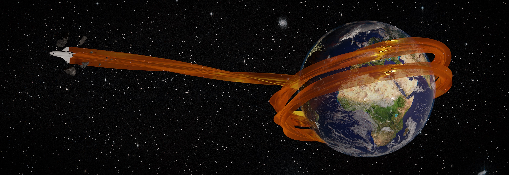
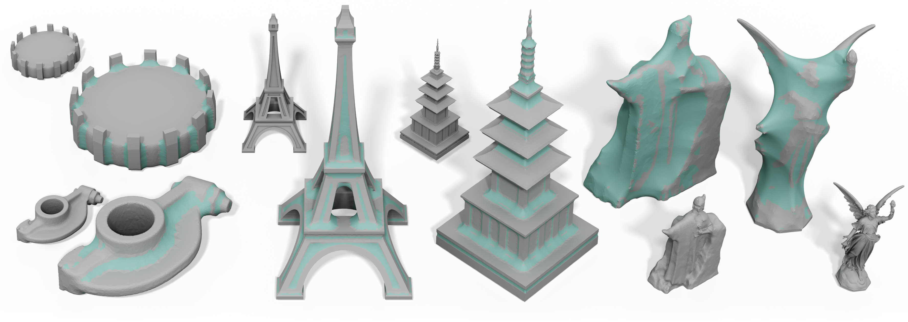
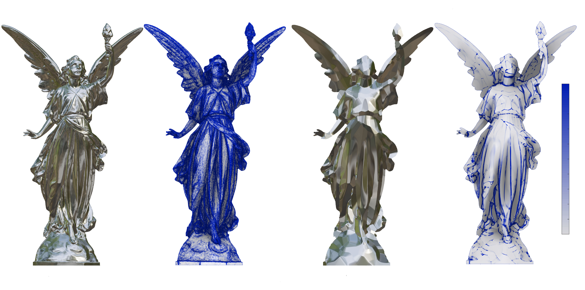
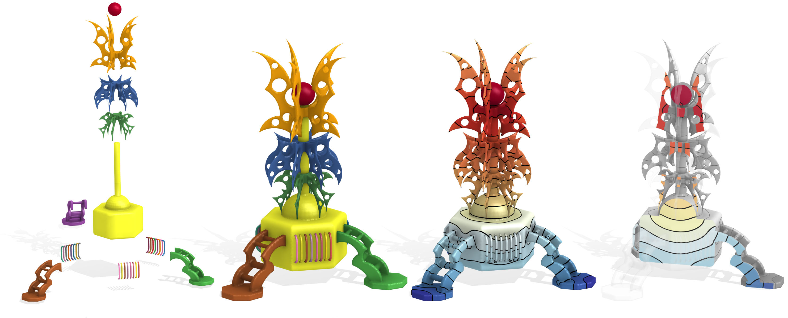

# Publications

    

      <table cellspacing="0" cellpadding="0" white>
      <tr>
        <td class='divTeaser'> </td>
        <td>
          

          Swept Volumes via Spacetime Numerical Continuation 
        

             
        

          <strong>Silvia Sell&aacuten</strong>, Noam Aigerman, Alec Jacobson 
           <i> ACM Transactions on Graphics (SIGGRAPH), 2021 </i> 
           [<a href="../data/pdf/swept-volumes.pdf">Paper</a>] [<a
       href="../data/pdf/swept-volumes-low-res.pdf">Paper (low res)</a>] [<a href="https://github.com/sgsellan/swept-volumes">Code</a>] [<a
       href="https://youtu.be/6iLqMQ3kd24">Video</a> ] [<a
       href="https://www.dgp.toronto.edu/projects/swept-volumes/">Project
       Page</a>] [<a href="https://youtu.be/tic3dLcCE8U">Talk </a>] 
          </h5>
        </td>
      </tr>
      <tr>
        <td class='divTeaser'> </td>
        <td>
          

          Opening and Closing Surfaces
        

             
        

          <b>Silvia Sell&aacuten</b>, Jacob Kesten, Ang Yan Sheng, Alec Jacobson 
           <i> ACM Transactions on Graphics (SIGGRAPH Asia), 2020 </i> 
          [<a href="../data/pdf/opening-and-closing-surfaces.pdf">Paper</a>] [<a
      href="../data/pdf/opening-and-closing-surfaces-low-res.pdf">Paper (low res)</a>] [<a href="https://github.com/sgsellan/opening-and-closing-surfaces">Code</a>] [<a
          href="https://youtu.be/KfiqhyhWFnY">Video </a>]
      [<a
                    href="https://www.dgp.toronto.edu/projects/opening-and-closing-surfaces/">Project
                    Page</a>]  [<a href="https://youtu.be/bBsudsHZPmw">Talk </a>]  
        </td>
      </tr>
      <tr>
          <td class='divTeaser'> </td>
          <td>
            

            Developability of Heightfields via Rank Minimization 
          

               
          

             <strong>Silvia Sell&aacuten</strong>, Noam Aigerman, Alec Jacobson 
             <i> ACM Transactions on Graphics (SIGGRAPH), 2020 </i> 
            [<a href="../data/pdf/compressed-developables.pdf">Paper</a>] [<a
          href="../data/pdf/compressed-developables-low-res.pdf">Paper
                (low res)</a>] [<a href="https://github.com/sgsellan/developability-of-heightfields">Code</a>] [<a
                href="https://www.dgp.toronto.edu/projects/compressed-developables/">Project
                  Page</a>] [<a
                  href="https://www.youtube.com/watch?v=mfJB7ehxWPY&feature=youtu.be">Talk
              </a>] 
          </td>
        </tr>
        <tr>
          <td class='divTeaser'> </td>
          <td>
            

            Solid Geometry Processing on Deconstructed Domains 
            

                 
            

            <b>Silvia Sell&aacuten</b>, Herng Yi Cheng, Yuming Ma, Mitchell Dembowski, Alec Jacobson 
            <i> Computer Graphics Forum (Eurographics), 2019 </i> 
            [<a href="../data/pdf/overlapping.pdf">Paper</a>] [<a
            href="https://www.dgp.toronto.edu/projects/deconstructed-domains/solid-geometry-processing-on-deconstructed-domains-cgf-2019-compressed-sellan-et-al.pdf">Paper
            (low res)</a>] [<a
                        href="https://arxiv.org/pdf/1807.00866.pdf">Arxiv</a>]
                    [<a
                        href="https://github.com/sgsellan/solid-geometry-processing-on-deconstructed-domains">Code</a>]
                    [<a
                        href="https://www.dgp.toronto.edu/projects/deconstructed-domains/">Project
                        Page</a>] [<a
                               href="https://www.youtube.com/watch?v=yjiHuoxQII8">Talk</a>]
          </td>
        </tr>
      </table>
    

  

 
 <a href="http://www.replicabilitystamp.org">Graphics Replicability Stamp</a> granted  English closed captioning    Spanish subtitles  U.S. Patent

