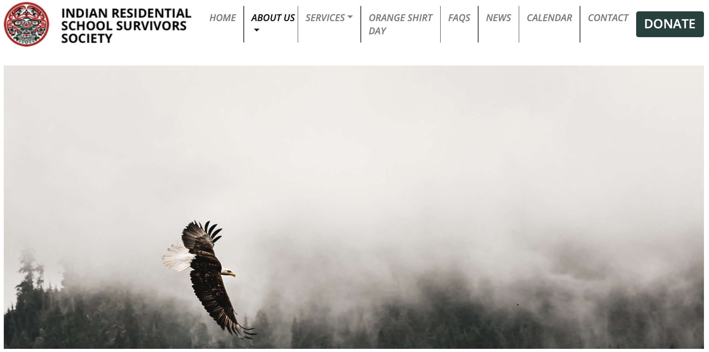
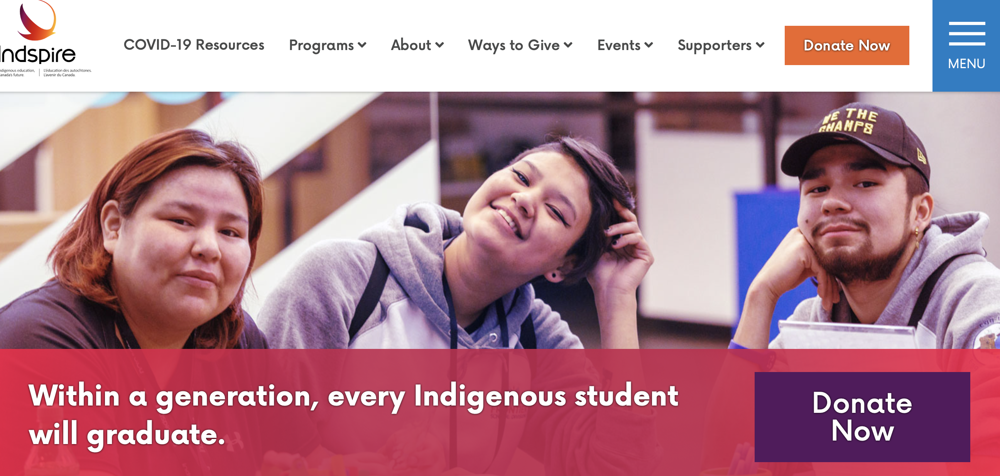
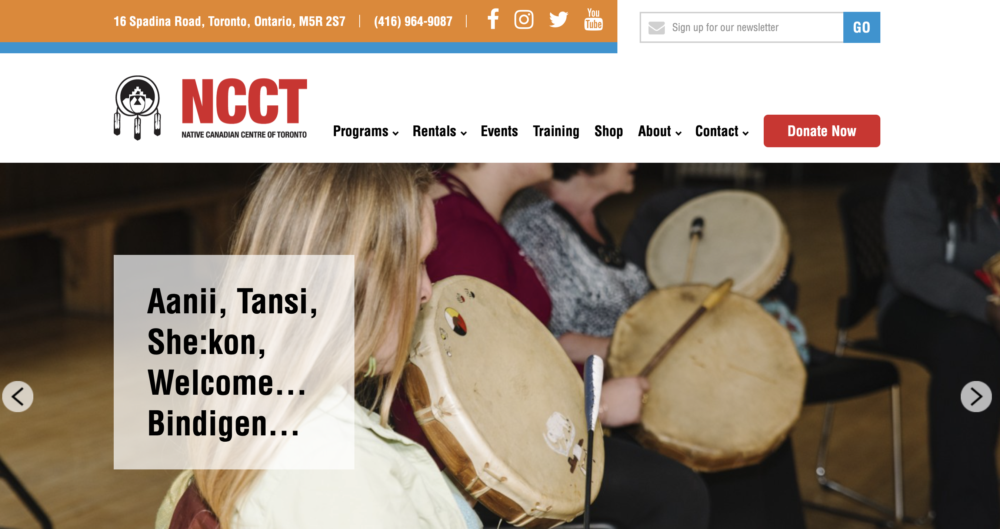

# National Day for Truth and Reconciliation

Today, September 30th 2021, marks the first [National Day for Truth and Reconciliation](https://www.canada.ca/en/canadian-heritage/campaigns/national-day-truth-reconciliation.html).

A few months ago, I was awarded an NSERC Vanier Graduate Scholarship. I felt incredibly honoured that, less than two years after arriving in this country, the Canadian government was making a choice to bet on my research and spend hard-earned Canadian taxpayer’s money on me. 

It came at a strange time, though, as we were getting daily reminders of the historical and present systemic neglect, erasure and discrimination faced by Indigenous people in Canada. It was hard not to feel like the same government was choosing to invest money in me, a white privileged European with no connection to this land, rather than on alleviating these injustices. 

This didn’t sit right with me, so after giving it some thought I decided to donate an amount equivalent to a portion of my scholarship to the following charities, and to make it public to encourage all of you who receive government funding to consider doing it as well:

- The *Indian Residential School Survivors Society* provides essential services to Residential School Survivors, their families, and those dealing with intergenerational trauma. Donate [here](https://www.irsss.ca).
 

  

 
 

- Residential “schools” were “schools” in name only. Systemic barriers make it so Indigenous people in Canada have been and are still denied a quality education. *Indspire* is a national charity that invests in the education of First Nations, Inuit and Métis people. Donate [here](https://indspire.ca/about/).
 

  

 
 

- 13.5% of First Nation communities in Canada and 40% of First Nation communities in Ontario do not have access to safe drinking tap water. *Water First*’s mission is to help address local water challenges in Indigenous communities through education, training and meaningful collaboration. Donate [here](https://waterfirst.ngo).
 

  

 
 

- One quarter of all Indigenous people and one third of all Indigenous children in Canadian urban areas live below the poverty line. Our neighbours in the *Native Canadian Center of Toronto* empower the Indigenous community in Toronto by providing programs that support their spiritual, emotional, physical and mental well-being. Donate [here](https://ncct.on.ca/about-us/). 
 

  

